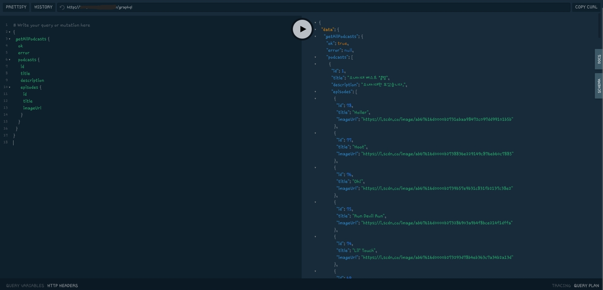
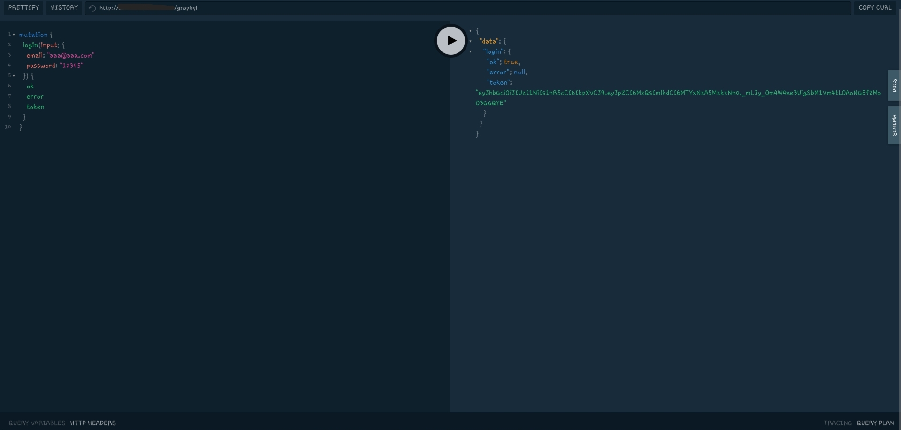

    

# Spotify 클론 코딩 : Backend

## 프로젝트 내용
세계 최대 음원 스트리밍 사이트 Spotify를 클론 코딩하였습니다.
Host와 Listener 권한으로 가입할 수 있고 Spotify에서 제공하는 API로 Host는 자신만의 음원 플레이 리스트를 만들 수 있습니다.

Listener는 Host가 만든 플레이 리스트를 검색하여 구독하고 청취할 수 있습니다.

NestJS 스터디를 위하여 개인적으로 개발한 사이트입니다.

## 주요 기능
- 회원가입, 로그인 시 GraphQL을 이용하여 Backend Validation 체크
- GraphQL을 이용한 데이터 쿼리 추출
- NestJS를 이용한 Role 권한 부여
- Spotify API를 이용한 음원 / 아트스트 검색
- 자신만의 플레이 리스트 생성
- 자신의 취향에 맞는 플레이 리스트 구독

## 사용 기술

## 링크

    <a href="https://spotify-clone-yjs.netlify.app/" target="_new">
        https://spotify-clone-yjs.netlify.app
    </a>

## 스크린샷

